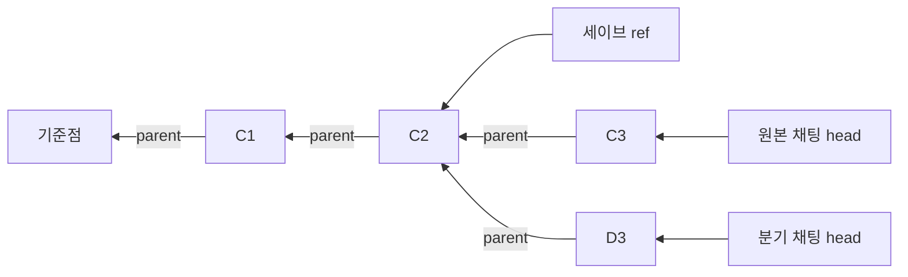

# BardWiki VCS: PR 설명과 구현 명세

**Wiki VCS는 “대화의 어느 시점에, 위키가 어떤 상태였는지”를 함께 기록하는 로컬 버전 관리 기능입니다.**

게임 세이브를 불러왔는데 도감에는 아직 만나지 않은 인물과 미래 사건이 남아 있다면 이야기가 어긋납니다. BardWiki에서도 대화만 되돌리고 위키를 그대로 두면 같은 문제가 생깁니다. Wiki VCS는 대화와 위키의 시점을 맞추고, 되돌리기 전 상태를 복구할 수 있게 보관합니다.

Git과 비슷하게 **커밋·분기·참조**를 사용하지만 Git 저장소는 아닙니다. Git 설치, 원격 저장소, push/pull, 분기 병합 기능은 포함하지 않습니다.

이 문서는 **현재 구현**을 설명합니다. [초기 설계 문서](../plan/bardwiki-versioned-save-system.md)는 배경 자료이며, 저장 포맷과 지원 범위는 아래 구현 명세를 기준으로 합니다.

- [1. Pull Request 설명](#1-pull-request-설명)
- [2. 자료구조와 저장 포맷](#2-자료구조와-저장-포맷)
- [3. 변경된 UI와 사용 흐름](#3-변경된-ui와-사용-흐름)
- [4. 호환성과 이전](#4-호환성과-이전)
- [5. 복구·동시성·성능과 제약](#5-복구동시성성능과-제약)

## 1. Pull Request 설명

이 절은 PR 본문에 사용할 수 있는 개요입니다.

### 제목

BardWiki: 대화·위키 시점 일치, 공유 버전 이력과 복구 가능한 세이브

### 문제

대화 삭제·재생성·분기·세이브 불러오기는 대화의 과거 상태를 선택하는 동작입니다. 위키가 최신 상태에 그대로 남으면 삭제한 사건이나 다른 분기의 지식이 다음 응답에 들어갈 수 있습니다. 반대로 매번 위키 전체를 복사하면 긴 채팅의 자동 세이브와 분기 비용이 커집니다.

### 변경 내용

- 위키 변경을 대화 근거와 연결된 커밋으로 기록합니다.
- 같은 캐릭터의 채팅은 불변 커밋과 파일 객체를 공유하고, 각 채팅은 독립적인 분기와 현재 작업용 Markdown을 가집니다.
- 대화 삭제·편집·확정 응답 재생성·과거 시점 분기·세이브 불러오기에서 위키도 맞는 시점으로 이동하거나 필요한 구간을 재분석합니다.
- 파괴적인 전환 전 상태를 복구 참조로 보존합니다. 원래 채팅 복원과 새 채팅으로 복구를 지원합니다.
- 자동 세이브는 위키 전체 복사 대신 커밋과 중복 제거된 대화 상태를 참조합니다. 수동·퀵세이브는 기존 스냅샷 포맷을 유지합니다.
- 분석 반영과 시점 복원은 journal로 복구합니다. 분석 receipt와 메시지 확정 상태도 해당 반영 결정에 포함합니다.
- 분석·세이브·위키 조회에서 대화와 커밋 경계를 검사합니다. 오래된 화면이나 분석 결과로 최신 상태를 덮어쓰지 않습니다.
- 위키의 **이력** 화면, 복구 동작, 참조형 세이브의 호환 내보내기를 추가합니다.

### 핵심 규칙

> 위키의 대화 근거가 현재 대화와 일치해야 합니다. 맞는 과거 기록이 없으면 더 오래된 기록을 몰래 선택하지 않고 재분석하거나 작업을 거부합니다.

이미 기록된 상태를 여는 **정확한 복원**과, 과거 대화를 모델로 다시 분석하는 **재구성**은 구분합니다. 기존 채팅을 처음 버전 관리할 때는 현재 상태를 기준점으로 삼으며, 그 이전의 파일 이력을 만들어 내지 않습니다.

### 범위 밖

분기 병합, 원격 동기화 프로토콜, Git 실행 파일 연동, 앱 전체 설정의 버전 관리는 포함하지 않습니다. 기존 Markdown 위키와 v1 스냅샷 세이브를 다른 포맷으로 일괄 교체하지도 않습니다.

## 2. 자료구조와 저장 포맷

### 2.1. 용어와 관계

| 용어 | 쉬운 설명 | 실제 역할 |
| --- | --- | --- |
| 커밋(commit) | 위키 변경 기록 한 건 | 부모 커밋, 변경 파일, 대화 근거를 가진 불변 레코드 |
| 파일 객체(blob) | 특정 버전의 파일 내용 | 내용의 SHA-256으로 주소를 정한 UTF-8 파일 |
| 분기(branch) | 채팅 하나의 진행 경로 | 해당 채팅의 현재 커밋인 `head`를 가리키는 가변 레코드 |
| 작업 트리(working tree) | 지금 열고 편집하는 위키 | 채팅별 `wiki/`의 일반 Markdown 파일 |
| 참조(ref) | 저장·복구 시점의 책갈피 | 커밋과, 필요한 경우 대화 상태를 보존하는 이름표 |
| 위키 체크포인트 | 파일 목록의 중간 계산 결과 | 특정 커밋의 전체 `경로 → blob hash` 맵 |
| 대화 상태(chat state) | 복구할 대화 전체 | 대화 헤더·메시지 조각·인덱스 트리를 공유하는 저장 그래프 |

커밋은 `parent` 하나만 가집니다. 분기는 과거 커밋에서 갈라질 수 있지만, 두 부모를 갖는 merge commit은 없습니다.



위 예에서 두 채팅은 `C0`부터 `C2`까지 공유합니다. 분기를 만들 때 과거 커밋과 blob을 복제하지는 않지만, 새 채팅에서 사용할 **작업 트리의 Markdown 파일은 실제로 작성**합니다. 공유 이력과 작업용 파일 복사를 혼동하면 안 됩니다.

### 2.2. 실제 디렉터리 배치

`dataRoot`는 서버의 사용자 데이터 루트입니다. `b64(x)`는 UTF-8 문자열의 **패딩 없는 base64url 인코딩**입니다. 아래는 Wiki VCS와 메모리 워크스페이스 경로이며, 별도로 저장되는 채팅 정본 JSON/JSONL 트리 전체를 나타내는 것은 아닙니다.

```text
<dataRoot>/risubard/characters/id-<b64(characterId)>/chats/
├── id-<b64(chatId)>/
│   ├── wiki/                          # 이 채팅의 작업 트리
│   ├── wiki-vcs-link.json             # 작업 트리와 branch 연결
│   └── ...                            # 기존 메모리 파일
├── id-<b64("save-slot:" + saveId)>/
│   ├── risubard-save-reference.json    # 참조형이면 사용
│   └── ...                            # v1이면 manifest·chat.bin·wiki 등
└── wiki-vcs/                          # 같은 캐릭터의 공유 저장소
    ├── format.json
    ├── objects/<hash 앞 2자리>/<64자리 hash>
    ├── commits/<commitId>.json
    ├── checkpoints/<commitId>.json
    ├── chat-state/<64자리 hash>
    ├── refs/
    │   ├── branches/<b64(branchId)>.json
    │   ├── saves/<b64(refId)>.json
    │   ├── recovery/<b64(refId)>.json
    │   └── autosaves/<b64(refId)>.json
    └── operations/<operationId>/
        ├── journal.json
        └── receipt.json               # 지원되는 작업의 완료 기록
```

**공유 저장소는 캐릭터 디렉터리 바로 아래가 아니라 `chats/wiki-vcs/`에 있습니다.** 각 채팅의 `wiki/` 안에 저장소를 만들지 않습니다. 분기·참조 파일 이름은 ID를 인코딩하고, 작업 디렉터리의 `operationId`에는 경로 구분자·NUL·`.`·`..`을 허용하지 않습니다.

`format.json`에는 `schemaVersion: 1`과 `createdAt`이 있습니다. 다른 저장소 schema version은 현재 구현에서 오류로 거부합니다. JSON 파일은 종류에 따라 들여쓰기·끝 개행 유무가 다르므로, 모든 파일이 같은 pretty JSON이라고 가정하면 안 됩니다.

### 2.3. 커밋과 파일 객체

`WikiCommitRecord`의 필드는 다음과 같습니다.

| 필드 | 타입 / 의미 |
| --- | --- |
| `schemaVersion` | `1` |
| `id` | 64자리 소문자 hex SHA-256 커밋 ID |
| `parent` | 부모 커밋 ID 또는 `null` |
| `operationId` | 이 커밋을 만든 작업 ID |
| `kind` | `baseline`, `analysis`, `manual`, `admin`, `external`, `rebuild`, `import`, `review`, `policy` |
| `changes` | `{ path: string, before: string \| null, after: string \| null }[]` |
| `chatAnchor` | 어느 대화까지의 근거인지 나타내는 아래 anchor |
| `analysisReceiptRef?` | 개별 분석 receipt를 저장한 blob hash |
| `provenance` | `recorded`, `legacy-baseline`, `reconstructed` |
| `createdAt` | 생성 시각 문자열 |

`path`는 `wiki/` 기준의 `/` 구분 상대 경로입니다. `before`·`after`는 **파일 전체 내용**의 blob hash입니다. 생성은 `before: null`, 삭제는 `after: null`입니다. 텍스트 줄 단위 patch나 바이너리 차분을 저장하지 않습니다. 큰 문서에서 한 줄만 바뀌어도 새 버전의 문서 전체가 하나의 blob이 됩니다.

다음은 문서 작성 중 실제 격리 저장소에서 생성한 커밋입니다. 긴 ID는 설명용 축약값이 아니라 유효한 전체 해시입니다.

```json
{
  "schemaVersion": 1,
  "id": "0577519958ce9a1dfaa7f5ee02ea837e0ecd3195291093ed64738f82bd4602bb",
  "parent": "52ad5472081f94c5b9a7ceb2b43ed4367e89f5a24347697f523248c98ec606ee",
  "operationId": "doc-edit-17",
  "kind": "manual",
  "changes": [
    {
      "path": "concepts/Clock.md",
      "before": "b1cec2c6d91cb742c4c17defc36ec69a8035069fea352b7b9d4b21aff3d2647f",
      "after": "eecc12daa13ace1473fab623db2d4b6164a7b6291eb63f396a53833c433e3c0c"
    }
  ],
  "chatAnchor": {
    "sourceChatId": "doc-chat",
    "boundaryMessageId": "doc-message-64",
    "prefixDigest": "83e3f9751f4883a8",
    "evidenceDigest": "cff47b6f2c03d291"
  },
  "provenance": "recorded",
  "createdAt": "2026-01-01T00:00:00.000Z"
}
```

해시 계산 방식은 구분해야 합니다.

| 값 | 계산 대상 / 인코딩 |
| --- | --- |
| blob hash | 파일 내용 문자열의 UTF-8 바이트에 SHA-256, 소문자 hex 64자리 |
| commit ID | 서버가 구성한 **`id`를 제외한 payload**의 `JSON.stringify` 결과에 SHA-256, hex 64자리 |
| `materializedRevision` | 경로로 정렬한 `[path, blobHash]` 쌍 배열의 `JSON.stringify` 결과에 SHA-256, hex 64자리 |
| anchor digest | FNV 기반의 구현 전용 비교 digest, hex 16자리. SHA-256이나 보안 서명이 아님 |
| 문서 API의 `contentHash` | 문서 바이트에 SHA-256, **base64url**. VCS의 hex hash와 표현이 다름 |

커밋 파일을 통째로 해시하거나 JSON 키를 임의로 재정렬한 결과는 커밋 ID 계산 방식과 다릅니다. `createdAt`, 부모, 작업 ID도 payload에 포함되므로 파일 내용이 같다고 커밋 ID까지 같지는 않습니다. blob은 같은 저장소 안에서 **바이트가 완전히 같을 때** 공유하며, 읽을 때 checksum을 확인합니다.

추적 대상은 소문자 `.md`로 끝나는 유효한 상대 경로입니다. 루트의 `index.md`와 아래 루트 디렉터리의 내용은 제외합니다.

```text
.risubard-history/
.risubard-trash/
.risubard-snapshots/
.risubard-recovery/
.risubard-fork/
```

`index.md`는 문서에서 다시 만드는 파생 파일입니다. 그 밖의 `.md`는 review baseline을 포함해 추적합니다. 이미지·앱 설정·모델 credential을 이 커밋의 파일 집합에 넣지는 않습니다.

### 2.4. 대화 anchor: 메시지 ID만으로는 부족한 이유

`WikiChatAnchor`는 `sourceChatId`, `boundaryMessageId`, `prefixDigest`, `evidenceDigest`를 가집니다. 경계가 없으면 `boundaryMessageId`는 `null`입니다.

- **접두부(prefix)**: 첫 메시지부터 경계 메시지까지의 순서 있는 대화입니다. digest는 각 메시지의 안정 ID, 역할, 선택된 본문, `disabled`, `isComment`를 반영합니다.
- **근거(evidence)**: 실제 위키 작성기에 전달한 정규화된 근거입니다. digest는 메시지 ID·역할·본문을 반영합니다.
- anchor의 메시지 ID는 일반 채팅 메시지 객체의 `chatId` 필드에서 가져옵니다. 채팅 자체의 `id`와는 다릅니다.

ID가 같아도 본문이나 앞쪽 메시지가 바뀌면 기존 근거와 일치하지 않습니다. 또한 “과거 메시지를 재분석한 커밋”이라도 부모가 미래 사건을 담고 있으면 그 미래 내용을 상속합니다. 따라서 복원·분기 후보는 표시된 경계뿐 아니라 **부모 이력의 대화 의존성까지** 검사합니다.

끝에 사용자 입력이나 미확정 응답이 있는 경우에는, 필요한 확정 대화까지 일치하는 기록을 사용할 수 있습니다. 필요한 확정 기록이 빠졌다면 단순히 더 오래된 커밋을 고르는 방식으로 해결하지 않습니다.

### 2.5. 분기·작업 트리 연결·참조·체크포인트

| 레코드 | 실제 필드 |
| --- | --- |
| `WikiBranchRecord` | `schemaVersion: 1`, `id`, `characterId`, `chatId`, `head: string \| null`, `parentBranchId?`, `createdAt`, `updatedAt` |
| `WikiChatLink` | `schemaVersion: 1`, `characterId`, `chatId`, `branchId`, `materializedCommitId: string \| null`, `materializedRevision`, `originChatId?`, `updatedAt` |
| `WikiRefRecord` | `schemaVersion: 1`, `kind`, `id`, `commitId`, `characterId`, `chatId?`, `chatStateRef?`, `label?`, `reason?`, `createdAt` |
| `WikiCheckpointRecord` | `schemaVersion: 1`, `commitId`, `paths: Record<string, string>`, `createdAt` |

분기 ID는 `branch:<chatId>` 형태입니다. 분기의 `head`와 link의 `materializedCommitId`는 각각 진행 경로의 끝과 작업 트리에 반영된 시점을 나타냅니다. 둘을 연결하는 link만으로 과거 파일을 보존할 수는 없으며 실제 커밋·blob이 필요합니다.

ref의 `kind`는 `save`, `recovery`, `autosave`입니다. 복구 `reason`은 `truncate`, `reroll`, `chat-delete`, `save-load`, `reboot`, `purge-restore`, `fork` 중 하나입니다. `chatStateRef`가 있어야 위키뿐 아니라 저장된 대화도 복구할 수 있습니다.

체크포인트는 해당 커밋의 **전체 경로 맵**을 저장하되 파일 본문을 복사하지 않습니다. 경로 맵 복원은 가까운 체크포인트나 캐시에서 시작해 이후 delta를 재생합니다. 생성 조건은 현재 커밋의 부모 방향으로 체크포인트 없는 커밋을 16개 확인하는 것입니다. “커밋 번호가 16의 배수일 때 생성”이라는 규칙은 아닙니다.

여기서 위키 체크포인트와 메시지의 `scriptstateCheckpoint`는 다른 자료구조입니다. 후자는 응답 전·후 스토리 변수의 `{ before, after }` 스냅샷이며, 스와이프별 체크포인트도 따로 보관합니다.

### 2.6. 분석 receipt와 확정 상태

분석 receipt는 “어느 메시지를 분석했고 어떤 사건·문서를 기록했는가”를 나타냅니다. 커밋에 저장되는 원본은 다음 구조입니다.

```typescript
interface CanonicalTurnReceipt {
    sourceMessageIds: string[]
    eventIds: string[]
    changes: Array<{
        documentId: string
        type: 'character' | 'location' | 'scene' | 'faction'
            | 'creature' | 'item' | 'concept' | 'other'
        title: string
        relativePath: string
        action: 'create' | 'update'
        afterHash: string
    }>
    warnings: string[]
    recordedAt: string
    vcsCommitIds?: string[]
    recovery?: {
        inputHash: string
        deferred: Array<{
            documentId: string | null
            type: 'character' | 'location' | 'scene' | 'faction'
                | 'creature' | 'item' | 'concept' | 'other'
            title: string
            contentHash: string | null
            warning: string
        }>
    }
}
```

원본 receipt의 JSON을 먼저 blob으로 저장하고 `analysisReceiptRef`를 커밋에 포함합니다. 이번 커밋 ID를 원본 receipt에 미리 넣지 않아 순환 해시를 만들지 않습니다. 정본 채팅 반영 때 `vcsCommitIds`에 커밋 ID를 넣고 메시지의 **`risubardCanonicalReceipt`**, **`risubardMemoryConfirmed`**를 함께 갱신합니다. 이 필드들의 `risubard`는 소문자입니다.

한 턴을 여러 번 분석했더라도 과거 복원에서는 선택한 커밋에서 도달 가능한 분석 결과만 남깁니다. 가상 첫 메시지의 receipt는 같은 첫 메시지 선택을 유지하면 보존합니다. 예전 커밋에 원본 receipt가 없으면 문서 변경으로 일부 재구성할 수 있지만, 원래 경고·재시도 상태를 증명할 수 없으므로 부분 재구성만으로 턴을 확정하지 않습니다.

### 2.7. 대화 상태의 chunk/tree 포맷

대화 상태 객체는 `wiki-vcs/chat-state/<hash>`에 있습니다. **확장자가 없고, 모든 객체의 주소는 저장 문자열의 SHA-256 hex입니다.** 객체 종류별 실제 내용은 다릅니다.

| 종류 | 디스크 내용 |
| --- | --- |
| 대화 헤더 | `message` 배열을 제외한 Chat 객체를 MessagePack으로 인코딩한 **일반 base64 문자열** |
| 메시지 하나 | 메시지 객체를 MessagePack으로 인코딩한 **일반 base64 문자열** |
| 메시지 leaf | `{"schemaVersion":1,"kind":"messages","hashes":[...]}` JSON. 최대 64개 메시지 hash |
| 상위 branch node | `{"schemaVersion":1,"kind":"branch","hashes":[...]}` JSON. 최대 32개 하위 node hash |
| 현재 root manifest | `schemaVersion: 3`, `header`, `messageCount`, `messagesRoot`를 가진 JSON |

즉 헤더·메시지 파일은 raw MessagePack 바이너리가 아닙니다. base64 텍스트를 읽은 뒤 MessagePack을 풀어야 합니다. JSON node의 `hashes`도 본문이 아니라 하위 객체의 주소입니다.

위 격리 저장소의 66개 메시지 root 예시입니다.

```json
{
  "schemaVersion": 3,
  "header": "14cc551044557c17ee75204d9d32cde18a9ce8c3b5a47c205cc7e123ece3bd9e",
  "messageCount": 66,
  "messagesRoot": "ad50dd250b12f115c9eab5c6a99fe8488c4389f562cd2fa680f732e7cfb3991f"
}
```

이 `messagesRoot`는 두 leaf를 가리키는 다음 상위 node입니다. 각 leaf는 각각 64개와 2개 메시지를 가리킵니다.

```json
{
  "schemaVersion": 1,
  "kind": "branch",
  "hashes": [
    "b58fda2a4abdb0710ebefce4e12aa1437a3d71aaa148cb31184a481c7ff8e1ed",
    "9015fe71df1acc9b7d60356e7f570e466b8f4bdab8b2e6de274c969f8d7a4507"
  ]
}
```

메시지 0개이면 `messagesRoot: null`입니다. 반복 저장은 바뀐 메시지, 관련 leaf·상위 node, 필요한 헤더와 root만 새로 씁니다. 이전의 전체 `messages: string[]` 목록을 갖는 **root schema 2**와 불투명한 기존 저장 문자열도 reader가 지원합니다. 현재 writer는 정상 Chat 스냅샷에 root schema 3을 씁니다.

### 2.8. 세이브 포맷: 스냅샷과 참조형

**v1 스냅샷**은 세이브 워크스페이스에 현재 위키 파일과 다음 파일을 보관합니다.

- `risubard-save.json`: `schemaVersion: 1`, `saveId`, `sourceChatId`, `sourceChatName`, `createdAt`, `turnCount`, 선택적 `latestMessageId`·`latestEvent`.
- `chat.bin`: 저장 대상 Chat 객체의 **MessagePack 바이너리**. `chat-state/`의 base64 텍스트와 다릅니다.
- `risubard-save-vcs.json`: 선택적 VCS sidecar. `schemaVersion: 1`, `mode: 'v1-snapshot'`, 세이브·원본 채팅 ID, 시각과 선택적 `commitId`, `branchId`, `head`, `chatStateRef`, `wikiRefId`, `manifestHash`, `chatHash`를 가집니다.

v1 manifest는 알 수 없는 필드를 거부하는 기존 계약을 유지합니다. 따라서 VCS 메타데이터를 그 manifest에 추가하지 않고 별도 sidecar에 둡니다. sidecar 없는 예전 스냅샷도 유효합니다.

**참조형 세이브**는 `risubard-save-reference.json`에 대화 상태와 위키 커밋을 가리킵니다. 위키 작업 트리 전체나 `chat.bin`을 세이브마다 복사하지 않습니다.

```json
{
  "schemaVersion": 1,
  "mode": "commit-reference",
  "saveId": "__risubard_auto__doc-chat__0",
  "sourceChatId": "doc-chat",
  "sourceChatName": "Format example",
  "createdAt": "2026-01-01T00:00:00.000Z",
  "turnCount": 33,
  "chatStateRef": "289c44fdb35de0c8d500b794f557b8852a4ad5d218a3155cec3a7a4b55bbc0d7",
  "wikiCommitId": "0577519958ce9a1dfaa7f5ee02ea837e0ecd3195291093ed64738f82bd4602bb",
  "latestMessageId": "doc-message-65"
}
```

계약상 `branchId`, `wikiRevision`, `latestEvent`도 선택적으로 허용합니다. `chatStateRef`는 대화 상태 root이고 `wikiCommitId`는 위키 시점입니다. API 응답에 추가되는 `chatHash`, `wikiRefId`, `capturedCommitId`를 이 저장 manifest의 필드와 혼동하면 안 됩니다. 런타임은 자동 세이브에 `autosave:<saveId>` ref를 만들어 해당 객체를 보존합니다.

**버전 번호는 포맷별로 독립적입니다.** 저장소·커밋·ref·위키 체크포인트·세이브 manifest는 schema 1, 현재 대화 상태 root는 schema 3, 트리 node는 schema 1입니다. “Wiki VCS v3”로 전체 포맷을 부르면 부정확합니다.

### 2.9. 작업 journal과 완료 receipt

`journal.json`은 파일 반영과 복구의 계획입니다. `receipt.json`은 지원되는 작업이 완료됐다는 결과입니다. 위의 분석 receipt와도 별개입니다.

| journal 필드 | 의미 |
| --- | --- |
| `schemaVersion`, `operationId`, `characterId`, `chatId`, `branchId` | 포맷과 작업 소유자 |
| `previousHead`, `commitId` | 전환 전·후 커밋 |
| `mode?` | `commit`, `baseline`, `publish`, `checkout` |
| `changedPaths`, `beforePaths?`, `targetPaths?` | 변경 경로와 작업 전·후 blob hash. 없는 파일은 `null` |
| `previousChatStateRef?`, `chatStateRef?` | 함께 전환할 정본 채팅의 전·후 상태 |
| `memoryForkToken?` | 같은 결정으로 완료할 기존 워크스페이스 교체 작업 |
| `recoveryRefId?`, `reason?` | 전환 전 상태를 보존할 복구 참조 |
| `checkpointCreated` | 체크포인트 생성 여부 |
| `prepared`, `published`, `createdAt` | 재생 준비 완료, 반영 완료, 시각 |

완료 receipt는 `schemaVersion: 1`, `status: 'completed'`, 작업·소유자 ID, `commitId`, `previousHead`, `changedPaths`, `checkpointCreated`, `createdAt`, 선택적 `recoveryRefId`를 가집니다. 모든 mode가 완료 receipt 파일을 만드는 것은 아닙니다. 현재 `publish`·`checkout` 경로는 이 완료 결과를 사용해 응답 유실 후 같은 작업의 결과를 조회합니다.

## 3. 변경된 UI와 사용 흐름

### 위키의 이력 화면

Markdown 위키의 작업 공간 상단에 **이력** 탭이 있습니다.

- **커밋 이력**: 종류, 시각, 변경 문서 수를 표시합니다.
- **이 시점으로**: 변경 문서 수와 현재 상태 보존을 확인한 뒤 대화·변수·위키를 함께 되돌립니다. 현재 대화와 정확히 맞지 않는 항목은 실행할 수 없습니다.
- **복구 이력**: 되돌리기·재생성·채팅 삭제 등으로 보존한 기록을 표시합니다.
- **대화와 위키 복원**: 원래 채팅으로 복원합니다.
- **새 채팅으로 열기**: 원본 이력을 공유하는 별도 채팅으로 엽니다.
- **영구 삭제**: 복구 ref를 제거합니다. 다른 분기나 세이브가 같은 내용을 참조하면 공유 내용은 남습니다.

현재 비정확 이력 항목의 배지는 **기록 시작 이전**입니다. 이것이 모두 “VCS 도입 전 항목”만 뜻하는 것은 아닙니다. 대화 근거가 맞지 않는 경우도 있으므로, 실제 실행 전 preview와 prefix 검사가 판단 기준입니다. 활성 채팅과 이력 화면은 서버의 변경을 3초 간격으로 확인합니다.

### 기존 대화 동작에서 달라지는 점

| 사용자 동작 | 적용 방식 |
| --- | --- |
| 뒤쪽 메시지 삭제 | 남길 대화에 맞는 위키 커밋으로 이동 |
| 중간 메시지만 삭제·본문 편집 | 뒤의 대화를 유지하고, 변경 전의 안전한 시점부터 필요한 구간 재분석 |
| 이미 확정된 응답 재생성 | 이전 상태를 보존하고 응답 전 시점에서 생성. 실패하면 원본 복구 |
| 아직 확정되지 않은 응답의 재생성·스와이프 | 채택되지 않은 응답 때문에 위키를 바꾸지 않음 |
| 선택 메시지에서 분기 | **선택한 메시지를 포함한** 대화와 그 시점의 위키로 새 채팅 생성 |
| 세이브 불러오기 | 대화 상태와 저장된 위키 시점을 함께 복원 |

VCS 기록보다 과거로 이동하면 **이 시점은 위키 기록 시작 이전입니다** 안내와 재구성 흐름을 사용합니다. 복구가 미해결인 채팅은 편집·삭제·생성을 잠그며, 실패를 성공으로 숨기지 않습니다.

### 저장·불러오기 화면

- 수동 저장과 퀵세이브는 v1 스냅샷, 자동 세이브는 참조형입니다. 자동·퀵·수동 슬롯은 같은 목록에서 확인합니다.
- 참조형 슬롯의 **호환 세이브로 내보내기**는 별도 작업공간에서 v1 스냅샷을 만듭니다. 현재 대화와 위키를 되돌리지 않습니다.
- 참조형 슬롯을 수동으로 덮어쓰면 같은 슬롯에 v1 스냅샷을 저장합니다.
- 세이브 전에 정본 채팅 저장 완료를 기다립니다. 스트리밍 중에는 수동 저장·불러오기를 거부합니다.
- 자동 세이브 간격 기본값은 5턴, 보관 개수는 5개입니다. 설정 범위는 각각 1–100턴, 1–20개입니다. 턴 계산상 첫 턴부터 시작하므로 기본 간격의 저장 대상은 1·6·11…턴입니다. 생성·위키 분석 중에는 저장을 시작하지 않습니다.
- 보관 개수를 줄이면 참조형 슬롯까지 포함해 초과 슬롯을 정리합니다.

## 4. 호환성과 이전

### 지원 경계

| 데이터 / 동작 | 현재 동작과 주의점 |
| --- | --- |
| 기존 Markdown 위키 | 일반 파일 형식을 유지. 첫 VCS 접근에서 현재 상태를 `legacy-baseline`으로 기록 |
| 도입 전 과거 대화 | 당시 파일 이력이 없으므로 정확한 checkout 불가. 대화에서 다시 분석한 결과는 당시 파일의 복제본이 아님 |
| 기존 v1 세이브 | sidecar 없이도 읽기 가능. VCS 메타데이터는 기존 manifest 밖에 둠 |
| 수동·퀵세이브 / 호환 내보내기 | v1 스냅샷 계약을 유지해 기존 스냅샷 reader에 제공 |
| 참조형 자동 세이브 | VCS 도입 전 빌드는 직접 읽지 못함. 구버전용으로는 v1 호환 내보내기 사용 |
| 참조형 manifest만 다른 장치로 복사 | 대화 객체·커밋·blob이 없으므로 독립된 세이브가 아님. 관련 저장소를 함께 옮기거나 v1으로 내보내야 함 |
| 예전 대화 상태 root schema 2 | 현재 reader에서 지원. 새 정상 Chat 저장은 root schema 3 사용 |
| 같은 캐릭터에서 채팅 분기 | 공유 저장소의 커밋을 재사용하고 독립 branch 생성 |
| 다른 캐릭터로 워크스페이스 복사 | 대상 캐릭터에서 기준점을 만듦. 원본의 공유 커밋 그래프를 자동으로 공유하는 동작이 아님 |
| 위키 문서 패키지 가져오기 | 문서 가져오기 후 `import` 변경으로 기록. VCS 저장소 그래프 전체의 가져오기 기능은 아님 |
| 미래의 저장소 schema version | 현재 구현은 지원하지 않는 version을 거부. 모든 미래·과거 버전 사이의 양방향 호환을 보장하지 않음 |

### 세이브가 되돌리는 상태와 유지하는 설정

세이브는 메시지뿐 아니라 스토리 변수와 첫 메시지 선택 등 **이야기 상태**를 보관합니다. 반면 현재 사이드바의 모델·프롬프트·페르소나·토글 설정을 과거 값으로 되돌리는 기능은 아닙니다.

구체적으로 공통 저장 정책은 `bindedPersona`, `bindedBotPreset`, `usePromptPresetParams`, `useModelPreset`, `modelBinding`, `useLocallySetGlobalVariables`, `togglePresetBaseline`과 저장된 토글 설정을 분리합니다. `GLGlobalVariables`의 일반 변수는 저장 상태를 쓰지만 `toggle_`로 시작하는 값은 현재 설정을 유지합니다. 임시 placeholder와 스트리밍 표시 상태도 저장 비교에서 정규화합니다.

클라이언트와 서버가 같은 규칙을 사용하고, 서버는 저장될 전체 이야기 상태가 정본 채팅과 일치하는지 확인합니다. 메시지 본문만 같고 `scriptstate`나 첫 메시지 선택이 더 오래된 요청도 거부할 수 있습니다.

오래된 응답에 변수 체크포인트가 없는데 되돌릴 변수가 있다면, 위키를 재구성할 수 있다는 이유만으로 변수의 과거 값을 추측하지 않습니다. 필요한 `scriptstateCheckpoint`가 없다는 오류로 복원을 거부합니다.

### 이전·백업 시 주의

현재 `wiki/`만 복사하면 현재 Markdown은 남지만 과거 커밋·복구 기록·참조형 세이브의 대화 객체까지 옮긴 것은 아닙니다. 전체 이력을 유지하려면 사용자 데이터 전체 백업을 사용하고, 부분 이전에서는 공유 저장소와 관련 채팅·세이브 워크스페이스를 함께 보존해야 합니다. 저장 루트와 백업 계약은 [파일 정본 사용자 데이터](./file-native-storage.md)를 참고하세요.

VCS 파일·ref·link를 수동 편집해 복구하는 것은 정상적인 데이터 이전 방법이 아닙니다. 해시가 틀리거나 객체가 빠진 기록은 읽기·복구 과정에서 거부될 수 있습니다.

## 5. 복구·동시성·성능과 제약

### 5.1. 분석 반영과 중단 복구

새 분석의 주요 반영 흐름은 다음과 같습니다.

1. 문서 조회·모델 호출 전에 시작 커밋과 대화 근거를 고정합니다.
2. 변경 파일만 작업용 영역에 작성합니다. 나머지 문서는 기존 상태에서 읽습니다.
3. 반영 전 `expectedHead`와 정본 대화 prefix를 다시 검사합니다. 외부 편집도 먼저 발견·기록합니다.
4. 파일 blob과 원본 분석 receipt blob을 저장하고 커밋 ID를 결정합니다.
5. journal·커밋을 영속화하고 재생 준비를 완료합니다.
6. 변경 파일, branch/link, 필요한 정본 채팅·receipt·확정 상태를 반영합니다.
7. 완료 receipt를 기록하고 journal을 완료 상태로 만듭니다.

이는 **여러 파일을 OS 명령 하나로 동시에 교체한다는 뜻이 아닙니다.** 중단되면 journal을 재생하고, 앱의 해당 상태 접근을 완료까지 제한하는 논리적 일관성입니다. 외부 편집기는 작업 중 각 파일의 반영 상태를 볼 수 있습니다.

- 준비 전 작업은 폐기할 수 있고, 준비된 작업은 해당 채팅·분기 소유권을 확인해 재생합니다.
- 현재 파일이 작업 전 hash 또는 예정된 작업 후 hash와 같으면 안전하게 진행합니다.
- 둘 다 아니라면 새 외부 편집일 수 있으므로 덮어쓰지 않고 **복구 대기**로 멈춥니다. 오류의 경로·hash를 확인해 파일을 작업 전 또는 작업 후 내용으로 맞춘 뒤 다시 접근해야 합니다.
- 반영 결정이 영속화된 뒤에는 HTTP 취소·응답 유실만으로 “반영되지 않았다”고 판단할 수 없습니다. 같은 작업 ID의 완료 결과를 확인합니다.
- 채팅 전환 실패 후 되돌리기도 실패하면 원래 대화와 남은 복원 단계를 저장하고 UI를 잠급니다.
- 예전 디렉터리 교체가 중단되어 활성 위키가 없을 때 백업이 하나면 복원하지만, 여러 백업 중 하나를 임의로 선택하지 않습니다.

### 5.2. 동시성: 같은 시점으로 읽고, 충돌이면 중단

같은 서버 인스턴스의 캐릭터별 위키 저장소 변경은 직렬화합니다. 세이브는 채팅 정본 저장과 위키 경계 검사를 공유 저장 장벽 안에서 수행합니다. 이는 별도 서버 프로세스 여러 개가 같은 디렉터리를 동시에 쓰는 분산 락 보장은 아닙니다.

응답의 항상 포함 문서·현재 장면, 자동 검색, 의미 재검색과 과거 원문 조회는 **같은 고정 커밋**을 사용합니다. 중간에 위키나 대화 근거가 바뀌면 서로 다른 시점의 자료를 섞어 모델을 호출하지 않고 생성을 중단합니다. 다음 요청은 새 시점에서 시작합니다.

문서 편집은 별도의 `contentHash` 검사도 사용합니다. 화면을 오래 열어 두었다고 최신 파일을 조용히 덮어쓰지 않습니다. 커밋 경계 검사와 편집 내용 검사는 다른 보호 장치입니다.

### 5.3. 삭제와 GC: “영구 삭제”의 정확한 의미

일반 대화 삭제나 시점 되돌리기는 과거 객체를 즉시 없애지 않습니다. 복구 ref를 제거해도 다른 분기·세이브·복구 ref가 같은 커밋을 쓰면 그 이력은 유지됩니다. 이미 삭제된 채팅의 마지막 복구 ref를 지우면 해당 채팅의 branch pin도 정리합니다.

현재 GC는 두 그래프를 따로 따라갑니다.

- **위키 blob**: branch head, save/recovery/autosave ref, 완료 receipt가 없는 prepared journal에서 출발해 부모 커밋을 따라갑니다. 도달한 커밋의 `before`·`after` blob과 `analysisReceiptRef`를 보존합니다.
- **대화 상태**: 세이브에서 수집한 root, ref의 `chatStateRef`, 미완료 journal의 전·후 상태에서 출발해 헤더·메시지·트리 node를 보존합니다.

현재 blob GC는 commit JSON·체크포인트·완료 journal·receipt 자체를 청소하지 않습니다. baseline처럼 완료 receipt가 없는 prepared journal도 위키 GC의 추가 루트가 될 수 있습니다. 따라서 **ref 삭제는 참조 해제이지 저장소의 모든 흔적이나 바이트가 즉시 사라지는 보안 삭제가 아닙니다.**

위키와 대화의 내용은 평문 또는 base64로 저장됩니다. SHA-256 주소는 암호화가 아닙니다. 저장소와 백업은 대화 원문·과거 문서가 들어 있는 사용자 데이터로 취급해야 합니다.

### 5.4. 비용과 남아 있는 한계

| 경로 | 절약하는 비용 | 남는 비용 |
| --- | --- | --- |
| 위키 변경 기록 | 변경 없는 blob 공유, 변경 파일만 stage | 바뀐 파일 전체의 읽기·쓰기·hash, 작업 트리 확인 |
| 과거 경로 맵 복원 | 체크포인트와 최대 16개 경로 맵 캐시 | 필요한 delta 재생과 경로 맵 구성 |
| 참조형 자동 세이브 | 위키 전체 복사 생략, 메시지·인덱스 공유 | 입력 Chat 디코딩과 메시지 비교 순회 |
| 같은 캐릭터 분기 | 과거 커밋·blob 복제 생략 | 새 작업 트리 파일 작성 |
| 수동·퀵세이브 | 구버전 포맷 유지 | 스냅샷 워크스페이스 복사 |

대화 상태 writer는 서비스 인스턴스당 최근 4개 상태를 캐시합니다. 반복 저장에서 변경 없는 메시지의 직렬화·hash와 변경 없는 node 쓰기를 재사용합니다. 하지만 입력 스냅샷을 디코딩하고 메시지를 비교하는 작업은 남으므로 **자동 세이브 전체가 O(1)이 되었다고 주장하면 안 됩니다.**

문서 작성 중 65개 메시지 상태에서 메시지 1개를 추가하고 헤더 변수도 바꾸는 실제 저장을 실행했습니다. 새 객체는 헤더·메시지·leaf·상위 node·root **5개**였고, 새 root는 **195바이트**였습니다. 이는 해당 저장 그래프의 증가량 증거이며 자동 세이브 전체 지연이나 대규모 운영 성능 보장은 아닙니다.

### 5.5. 확인한 검증 범위

구현 검증에서는 새 회귀 테스트 13개와 Svelte·TypeScript 검사(`pnpm check`, 오류·경고 0건)를 확인했습니다. 실제 서버·브라우저 시나리오에서도 head 충돌, 중단 후 receipt/확정 복구, 오래된 세이브 거부, 과거 분기, 조회 중 source-change 중단, 참조형 세이브 불러오기와 수동 세이브를 확인했습니다. 브라우저의 모델 응답은 고정 fixture였으며 실제 외부 모델 제공자의 응답 품질 검증은 아닙니다.

이번 문서 작성에서는 별도 임시 저장소에서 **실제 VCS·세이브 구현**을 실행해 커밋/blob 해시, 디렉터리 배치, 분기의 객체 공유와 작업 트리 생성, 체크포인트, 대화 상태 round-trip, 참조형 manifest, v1 `chat.bin`을 확인했습니다. 기존 테스트는 다시 실행하지 않았습니다.

### 구현을 찾아볼 때

| 주제 | 소스 |
| --- | --- |
| 레코드·anchor·추적 경로 계약 | [wikiVcsContract.ts](../../src/ts/risubard/wikiVcsContract.ts) |
| 저장소 경로·blob·delta·tree·journal·GC | [risubard-wiki-vcs.ts](../../server/node/risubard-wiki-vcs.ts) |
| Markdown 위키와 버전 서비스 연결 | [risubard-wiki-versioning.ts](../../server/node/risubard-wiki-versioning.ts) |
| 정본 채팅 결합·세이브 경계·복구·호환 export | [risubard-memory-runtime.cjs](../../server/node/risubard-memory-runtime.cjs) |
| v1·참조형 세이브 디스크 계약 | [risubard-memory-save.ts](../../server/node/risubard-memory-save.ts) |
| 저장·불러오기 설정 분리와 자동 세이브 정책 | [memorySavePolicy.ts](../../src/ts/risubard/memorySavePolicy.ts) |
| 응답·스와이프의 변수 체크포인트 | [chatScriptstateCheckpoint.ts](../../src/ts/chatScriptstateCheckpoint.ts) |
| 커밋·복구 이력 UI | [RisuBardWikiHistory.svelte](../../src/lib/Others/RisuBardWikiHistory.svelte) |
| 참조형 내보내기와 슬롯 UI | [RisuBardSaveSlotsDialog.svelte](../../src/lib/SideBars/RisuBardSaveSlotsDialog.svelte) |

사용 동작 중심 설명은 [BardWiki 사용 가이드](memory-wiki.md), 서버 데이터·백업은 [파일 정본 사용자 데이터](./file-native-storage.md)를 참고하세요.
